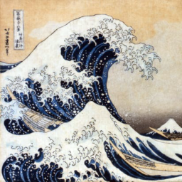
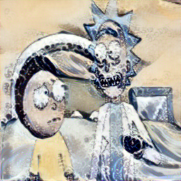

# PyTorch Implementation Of StyleTransfer

Original Paper [link](https://www.cv-foundation.org/openaccess/content_cvpr_2016/papers/Gatys_Image_Style_Transfer_CVPR_2016_paper.pdf)

# Result

| Content             |  Style |  Output             |
:-------------------------:|:-------------------------: |:-------------------------:
  |    |          
